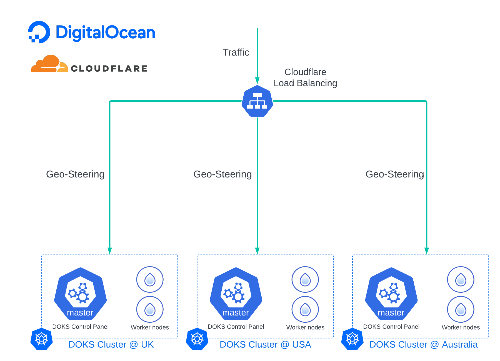

# DigitalOcean-Kubernetes-Multi-Regions-Load-Balancing
<!-- 

 -->
<!--
*** Thanks for checking out the Best-README-Template. If you have a suggestion
*** that would make this better, please fork the repo and create a pull request
*** or simply open an issue with the tag "enhancement".
*** Don't forget to give the project a star!
*** Thanks again! Now go create something AMAZING! :D
-->

<!-- PROJECT SHIELDS -->
<!--
*** I'm using markdown "reference style" links for readability.
*** Reference links are enclosed in brackets [ ] instead of parentheses ( ).
*** See the bottom of this document for the declaration of the reference variables
*** for contributors-url, forks-url, etc. This is an optional, concise syntax you may use.
*** https://www.markdownguide.org/basic-syntax/#reference-style-links
-->
<!-- [![Contributors][contributors-shield]][contributors-url] -->
<!-- [![Forks][forks-shield]][forks-url] -->
<!-- [![Stargazers][stars-shield]][stars-url] -->
<!-- [![Issues][issues-shield]][issues-url] -->
<!-- [![MIT License][license-shield]][license-url] -->
<!-- [![LinkedIn][linkedin-shield]][linkedin-url] -->

<!-- PROJECT LOGO -->
 

  

<h3 align="center">DigitalOcean | Multi-Region DOKS Clusters Load Balancing Tutorial </h3>

  

    This tutorial is mainly about how to setup multi-region DOKS clusters with geographical load balancing
     
    <a href="https://www.digitalocean.com/community/tags/kubernetes"><strong>Explore more Kubernetes tutorials»</strong></a>
     
     
  
  

<!-- ABOUT THE PROJECT -->
<!-- ## About The Project -->

<!-- [![Product Name Screen Shot][product-screenshot]](https://example.com) -->

<!--  -->
<!-- ### Built With -->
<!--  -->
<!-- * [Next.js](https://nextjs.org/) -->
<!-- * [React.js](https://reactjs.org/) -->
<!-- * [Vue.js](https://vuejs.org/) -->
<!-- * [Angular](https://angular.io/) -->
<!-- * [Svelte](https://svelte.dev/) -->
<!-- * [Laravel](https://laravel.com) -->
<!-- * [Bootstrap](https://getbootstrap.com) -->
<!-- * [JQuery](https://jquery.com) -->
<!--  -->
<!-- 
(<a href="#top">back to top</a>)
 -->

<!-- GETTING STARTED -->
# Getting Started

## Prerequisites

Below are what you will need before using Sauce Labs's API testing platform,
1. A DigitalOcean account ([Log in](https://cloud.digitalocean.com/login) or sign up by my [referal link](https://m.do.co/c/7c424df00920))
2. doctl CLI([tutorial](https://docs.digitalocean.com/reference/doctl/how-to/install/))
3. Kubernetes
4. A Cloudflare account

## Environmental setup

## Architecture diagram

(<a href="#top">back to top</a>)

<!-- USAGE EXAMPLES -->

<!-- CONTRIBUTING -->
<!-- ## Contributing -->
<!--  -->
<!-- <!-- <!-- <!-- Contributions are what make the open source community such an amazing place to learn, inspire, and create. Any contributions you make are **greatly appreciated**. --> 
<!--  -->
<!-- <!-- <!-- <!-- If you have a suggestion that would make this better, please fork the repo and create a pull request. You can also simply open an issue with the tag "enhancement". -->
<!-- <!-- Don't forget to give the project a star! Thanks again! --> 
<!--  -->
<!-- 1. Fork the Project -->
<!-- <!-- 2. Create your Feature Branch (`git checkout -b feature/AmazingFeature`) --> 
<!-- <!-- 3. Commit your Changes (`git commit -m 'Add some AmazingFeature'`) --> 
<!-- <!-- 4. Push to the Branch (`git push origin feature/AmazingFeature`) --> 
<!-- 5. Open a Pull Request -->
<!--  -->
<!-- <!-- 
(<a href="#top">back to top</a>)
 --> 

<!-- LICENSE -->
<!-- ## License -->

<!-- Distributed under the MIT License. See `LICENSE.txt` for more information. -->

<!-- 
(<a href="#top">back to top</a>)
 -->

<!-- CONTACT -->
## Contact

Jeff Fan - jfan@digitalocean.com

(<a href="#top">back to top</a>)

<!-- ACKNOWLEDGMENTS -->
<!-- ## Acknowledgments -->
<!--  -->
<!-- *  -->
<!-- *  -->
<!-- *  -->
<!--  -->
<!-- 
(<a href="#top">back to top</a>)
 -->

<!-- MARKDOWN LINKS & IMAGES -->
<!-- https://www.markdownguide.org/basic-syntax/#reference-style-links -->
[contributors-shield]: https://img.shields.io/github/contributors/github_username/repo_name.svg?style=for-the-badge
[contributors-url]: https://github.com/github_username/repo_name/graphs/contributors
[forks-shield]: https://img.shields.io/github/forks/github_username/repo_name.svg?style=for-the-badge
[forks-url]: https://github.com/github_username/repo_name/network/members
[stars-shield]: https://img.shields.io/github/stars/github_username/repo_name.svg?style=for-the-badge
[stars-url]: https://github.com/github_username/repo_name/stargazers
[issues-shield]: https://img.shields.io/github/issues/github_username/repo_name.svg?style=for-the-badge
[issues-url]: https://github.com/github_username/repo_name/issues
[license-shield]: https://img.shields.io/github/license/github_username/repo_name.svg?style=for-the-badge
[license-url]: https://github.com/github_username/repo_name/blob/master/LICENSE.txt
[linkedin-shield]: https://img.shields.io/badge/-LinkedIn-black.svg?style=for-the-badge&logo=linkedin&colorB=555
[linkedin-url]: https://linkedin.com/in/linkedin_username
[product-screenshot]: images/screenshot.png